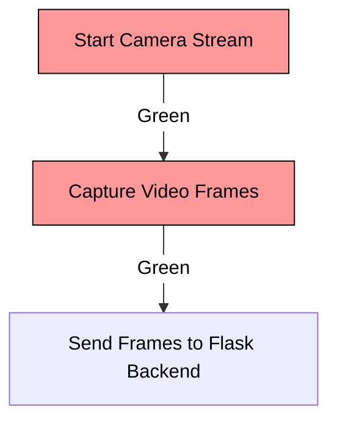
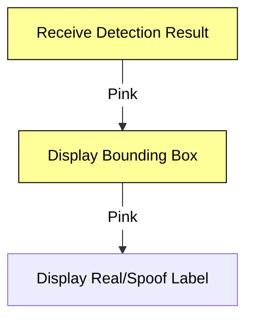
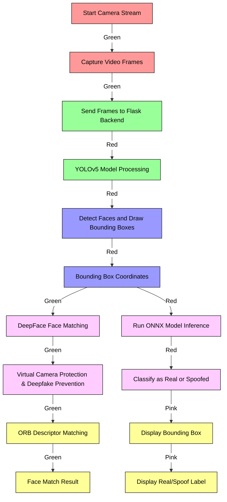

Here’s the updated project documentation with a full flowchart, detailed explanations, and Mermaid diagrams with colored headings, text, and arrows. The Mermaid diagrams are adjusted to reflect different colors for each module, and text colors are included as comments for CSS styling if needed.

---

# **Face Liveliness Check in Web Platform**

## **Key Features**

1. **Real-time Face Detection**:
   - Detects live faces in real-time via the web browser using the user’s camera.
   - Captures video frames for processing.

2. **Anti-Spoofing Protection**:
   - Identifies and prevents spoof attacks (e.g., photos, videos, or masks) using deep learning models.

3. **ONNX Model Integration**:
   - Uses ONNX Runtime for fast and lightweight model inference.

4. **Cross-Browser Support**:
   - Compatible with Chrome, Firefox, and Edge.

5. **Face Detection using YOLOv5**:
   - High-speed and accurate face detection.

6. **DeepFace Integration**:
   - Used for face matching, virtual camera protection, and deepfake prevention.

7. **Scalable Architecture**:
   - Built with React frontend and Flask backend.

---

## **System Architecture**

The **Face Liveliness Check** system involves capturing video frames from the browser, detecting faces, matching faces, and detecting spoof attacks. Here’s a detailed explanation of each component and how they interact:

1. **Video Stream Capture** (React Frontend):
   - Captures live video feed from the user's camera.
   - Sends individual frames to the Flask backend for processing.

2. **Face Detection** (YOLOv5 - Flask Backend):
   - Processes video frames to detect and bound faces.
   - Outputs bounding box coordinates for detected faces.

3. **Face Matching** (DeepFace and OpenCV - Flask Backend):
   - Extracts key points from detected faces and matches them with stored face data using DeepFace and ORB descriptors.
   - Includes virtual camera protection and deepfake prevention.

4. **Anti-Spoofing Detection** (ONNX Model - Flask Backend):
   - Classifies detected faces as real or spoofed using an ONNX model.
   - Provides liveness detection results.

5. **Result Display** (React Frontend):
   - Displays bounding boxes around detected faces and the liveness results (real/spoof) in real-time.

---

## **Flowchart Representation**

### **1. Video Stream Capture**



### **2. Face Detection**


### **3. Face Matching with DeepFace and ORB Descriptors**


### **4. Anti-Spoofing Detection**


### **5. Result Display**



### **Full Flowchart**



---

## **Detailed Workflow Explanation**

### **1. Video Stream Capture (React Frontend)**

Captures video from the camera using HTML5 `getUserMedia` API. Each frame is sent to the Flask backend for processing.

**Code Snippet (React - Capture Stream)**:
```js
useEffect(() => {
    navigator.mediaDevices.getUserMedia({ video: true }).then((stream) => {
        videoRef.current.srcObject = stream;
        videoRef.current.play();
    });
}, []);
```

### **2. Face Detection using YOLOv5 (Flask Backend)**

YOLOv5 processes frames to detect faces. Outputs bounding boxes with coordinates.

**Code Snippet (YOLOv5 Integration)**:
```python
import torch

model = torch.hub.load('ultralytics/yolov5', 'yolov5s')  # Load YOLOv5 model

def detect_faces(frame):
    results = model(frame)
    return results.xyxy[0]  # Return bounding boxes
```

### **3. Face Matching with DeepFace and ORB Descriptors (Flask Backend)**

DeepFace and ORB extract key points from faces and match them with stored descriptors. Includes virtual camera protection and deepfake prevention.

**Code Snippet (DeepFace Integration)**:
```python
from deepface import DeepFace

def match_faces(face_image):
    result = DeepFace.find(face_image, db_path='path_to_database')
    return result
```

**Code Snippet (ORB Descriptor Matching)**:
```python
import cv2

orb = cv2.ORB_create()
keypoints, descriptors = orb.detectAndCompute(face_image, None)
# Matching keypoints with stored descriptors...
```

### **4. Anti-Spoofing Detection using ONNX (Flask Backend)**

ONNX model classifies faces as real or spoofed. Model inference is quick, typically under 500ms.

**Code Snippet

 (ONNX Model Inference)**:
```python
import onnxruntime as ort

def detect_spoof(face_image):
    session = ort.InferenceSession('model.onnx')
    result = session.run(None, {'input': face_image})
    return result
```

### **5. Result Display (React Frontend)**

Displays bounding boxes and liveness results on the user's screen.

**Code Snippet (Display Results)**:
```js
function displayResults(results) {
    // Logic to render bounding boxes and labels on video feed
}
```

---

Feel free to modify the code snippets and flowcharts as needed for your documentation. Let me know if you need any more details or adjustments!
