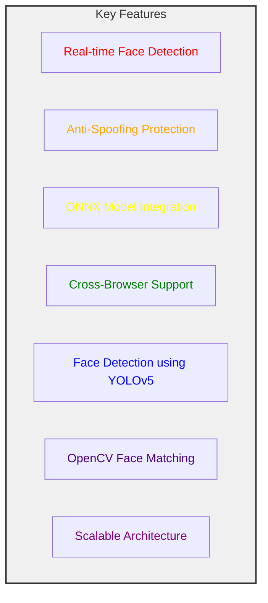
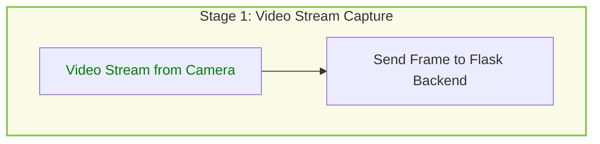
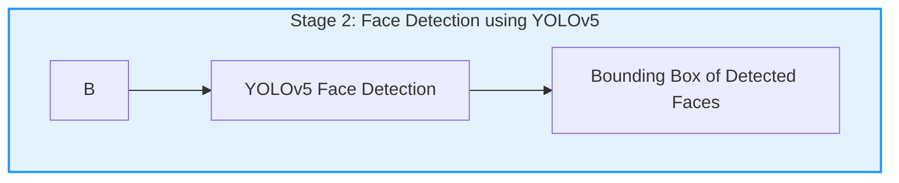
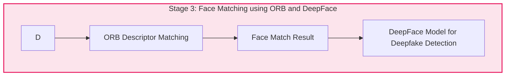
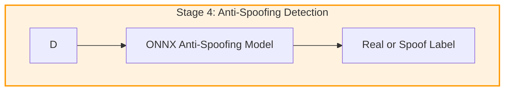
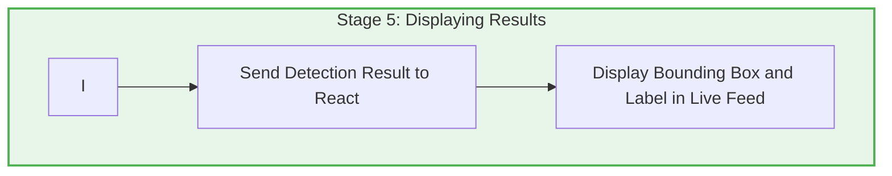
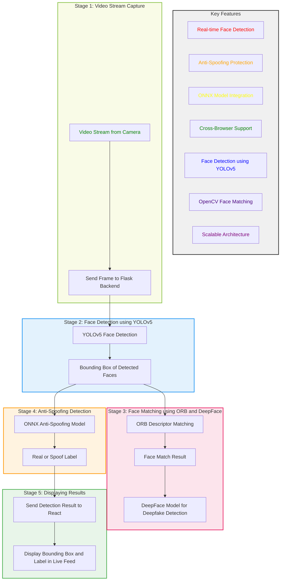

Here’s an enhanced version of the flowchart that includes **key features** and uses **color coding** to visually differentiate various stages of the process.

---

## Key Features (Colored for Clarity)

---

## Complete System Flowchart with Deepfake Detection and Face Matching

### Stage 1: Video Stream Capture (Frontend - React)

### Stage 2: Face Detection using YOLOv5 (Backend - Flask)

### Stage 3: Face Matching using ORB Descriptors (OpenCV) and DeepFace

### Stage 4: Anti-Spoofing Detection using ONNX (Backend)

### Stage 5: Displaying Results (Frontend - React)

---

### Full Flowchart

---

### System Overview with DeepFace Integration

- **Real-time Detection**: Video stream is captured from the camera and processed frame by frame.
- **YOLOv5 Detection**: Fast and accurate face detection using YOLOv5.
- **Face Matching**: Face is compared with known faces using **OpenCV ORB** and **DeepFace** models for added verification.
- **Deepfake Prevention**: DeepFace helps detect deepfake faces based on deep learning models.
- **Anti-Spoofing**: ONNX models classify whether the detected face is real or spoofed.
- **Result Display**: The live feed in the browser shows a bounding box with a label ("Real" or "Spoof").

---

This flowchart helps visualize the step-by-step process, with each part color-coded to easily distinguish between various stages and features.
