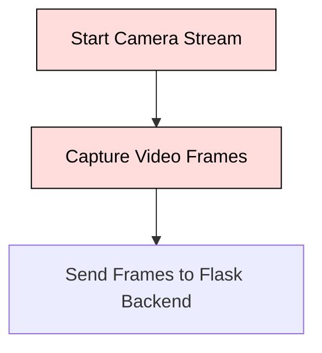
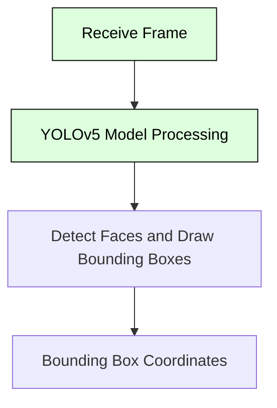
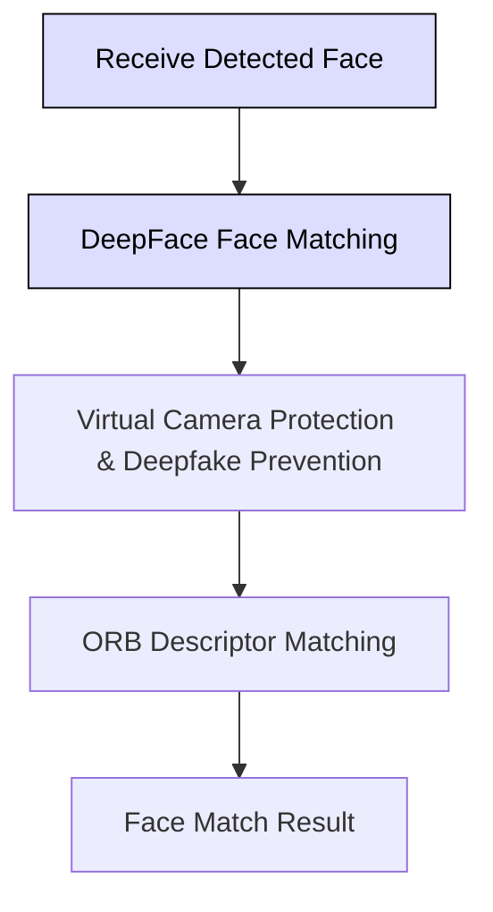
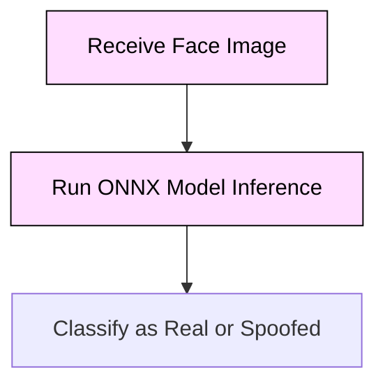
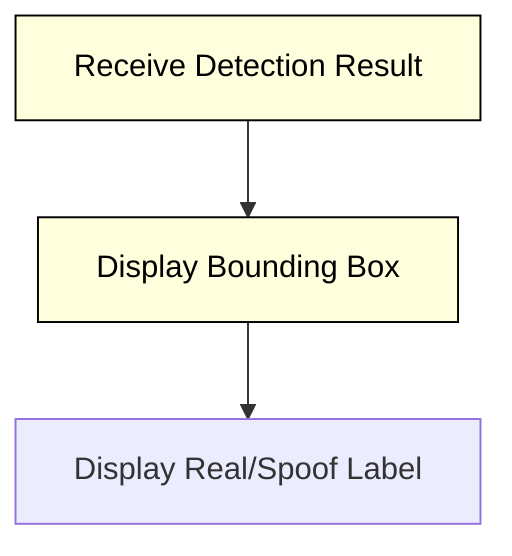
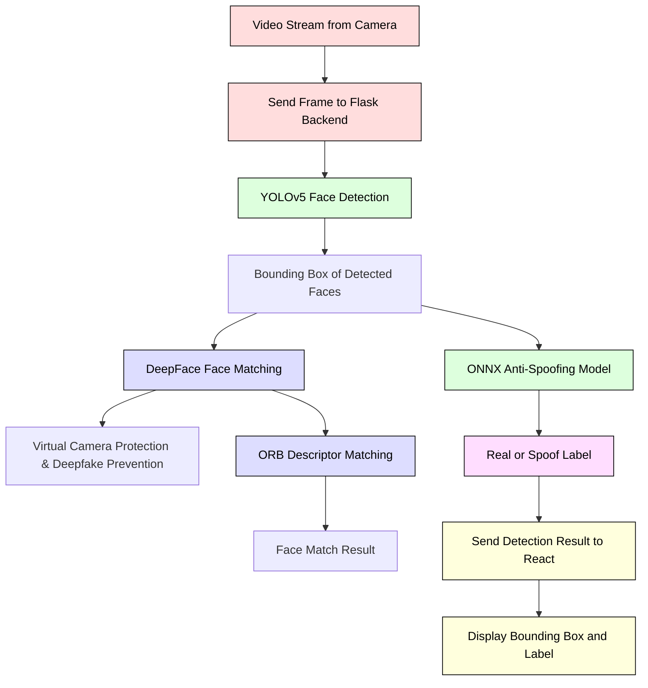

# **Face Liveliness Check in Web Platform**

## **Key Features**

1. **Real-time Face Detection**
   - Detects live faces in real-time using the user's camera via the web browser.
   - Captures video frames for processing.

2. **Anti-Spoofing Protection**
   - Identifies and prevents spoof attacks (e.g., photos, videos, or masks) using deep learning models.

3. **ONNX Model Integration**
   - Utilizes ONNX Runtime for fast and efficient model inference.

4. **DeepFace Integration**
   - Uses DeepFace for face matching, virtual camera protection, and deepfake prevention.

5. **Cross-Browser Support**
   - Compatible with major browsers: Chrome, Firefox, and Edge.

6. **Face Detection using YOLOv5**
   - Employs YOLOv5 for high-speed and accurate face detection.

7. **OpenCV Face Matching**
   - Matches faces using ORB descriptors for enhanced recognition.

8. **Scalable Architecture**
   - Built using React for the frontend and Flask for the backend, allowing easy scalability.

---

## **System Architecture**

The system architecture is designed to handle real-time video frames from the user's camera, detect faces, perform face matching, and carry out anti-spoofing checks. Here’s a detailed breakdown:

1. **Video Stream Capture** (React Frontend)
   - Captures live video feed from the user’s camera.
   - Sends video frames to the Flask backend for further processing.

2. **Face Detection** (YOLOv5 - Flask Backend)
   - Processes the received video frames to detect and locate faces.
   - Provides bounding box coordinates for each detected face.

3. **Face Matching** (DeepFace - Flask Backend)
   - Uses DeepFace for face matching and virtual camera protection.
   - Helps in preventing deepfake attacks.

4. **Face Matching with ORB Descriptors** (OpenCV - Flask Backend)
   - Extracts key features from the detected faces using ORB descriptors.
   - Matches these features with stored face data for enhanced recognition.

5. **Anti-Spoofing Detection** (ONNX Model - Flask Backend)
   - Uses an ONNX model to classify faces as real or spoofed.
   - Outputs the result of the liveness check.

6. **Result Display** (React Frontend)
   - Receives results from the backend.
   - Displays bounding boxes around detected faces and the liveness check results (real/spoofed).

---

## **Module-Specific Flowcharts**

### 1. **Video Stream Capture (React Frontend)**



**Explanation:**
- **Start Camera Stream**: Initializes the video stream from the user’s camera.
- **Capture Video Frames**: Continuously captures frames from the live video feed.
- **Send Frames to Flask Backend**: Transmits each frame to the Flask backend for processing.

### 2. **Face Detection (YOLOv5 - Flask Backend)**



**Explanation:**
- **Receive Frame**: Receives video frame from the frontend.
- **YOLOv5 Model Processing**: Processes the frame using YOLOv5 to detect faces.
- **Detect Faces and Draw Bounding Boxes**: Identifies faces and draws bounding boxes around them.
- **Bounding Box Coordinates**: Outputs the coordinates of detected faces.

### 3. **Face Matching with DeepFace and ORB Descriptors (Flask Backend)**



**Explanation:**
- **Receive Detected Face**: Receives the detected face image from YOLOv5.
- **DeepFace Face Matching**: Uses DeepFace for face matching and virtual camera protection.
- **Virtual Camera Protection & Deepfake Prevention**: Ensures the video feed is authentic and not generated by deepfakes.
- **ORB Descriptor Matching**: Uses ORB descriptors to further match faces.
- **Face Match Result**: Provides the result of the face matching process.

### 4. **Anti-Spoofing Detection (ONNX - Flask Backend)**



**Explanation:**
- **Receive Face Image**: Receives the face image for anti-spoofing detection.
- **Run ONNX Model Inference**: Uses an ONNX model to classify the face as real or spoofed.
- **Classify as Real or Spoofed**: Outputs the classification result.

### 5. **Result Display (React Frontend)**



**Explanation:**
- **Receive Detection Result**: Receives results from the Flask backend.
- **Display Bounding Box**: Draws bounding boxes around detected faces.
- **Display Real/Spoof Label**: Shows the result of the liveness check (real or spoofed).

---

## **Full Flowchart**



---

## **Detailed Workflow Explanation**

### 1. **Video Stream Capture (React Frontend)**

Captures video from the camera using HTML5 `getUserMedia` API. Each frame is sent to the Flask backend for processing.

**Code Snippet (React - Capture Stream)**:
```js
useEffect(() => {
    navigator.mediaDevices.getUserMedia({ video: true }).then((stream) => {
        videoRef.current.srcObject = stream;
        videoRef.current.play();
    });
}, []);
```

### 2. **Face Detection using YOLOv5 (Flask Backend)**

YOLOv5 processes frames to detect faces. Outputs bounding boxes with coordinates.

**Code Snippet (YOLOv5 Integration)**:
```python
import torch

model = torch.hub.load('ultralytics/yolov5', 'yolov5s')  # Load YOLOv5 model

def detect_faces(frame):
    results = model(frame)
    return results.xyxy[0]  # Return bounding

 boxes
```

### 3. **Face Matching with DeepFace and ORB Descriptors**

- **DeepFace**: Matches detected faces with known faces, ensuring virtual camera protection.
- **ORB Descriptors**: Enhances face matching with detailed feature extraction.

**Code Snippet (DeepFace Integration)**:
```python
from deepface import DeepFace

def match_faces(image1, image2):
    result = DeepFace.verify(image1, image2)
    return result['verified']
```

**Code Snippet (ORB Descriptors with OpenCV)**:
```python
import cv2

orb = cv2.ORB_create()

def match_with_orb(image1, image2):
    kp1, des1 = orb.detectAndCompute(image1, None)
    kp2, des2 = orb.detectAndCompute(image2, None)
    bf = cv2.BFMatcher(cv2.NORM_HAMMING, crossCheck=True)
    matches = bf.match(des1, des2)
    return len(matches)
```

### 4. **Anti-Spoofing Detection (ONNX Model)**

Classifies faces as real or spoofed using an ONNX model.

**Code Snippet (ONNX Integration)**:
```python
import onnxruntime as ort

session = ort.InferenceSession('model.onnx')

def detect_spoofing(image):
    result = session.run(None, {'input': image})
    return result[0]
```

### 5. **Result Display (React Frontend)**

Displays the results from the backend, including bounding boxes and liveness check labels.

**Code Snippet (React - Display Results)**:
```js
const displayResults = (results) => {
    setBoundingBoxes(results.boundingBoxes);
    setLivenessLabel(results.liveness);
};
```
