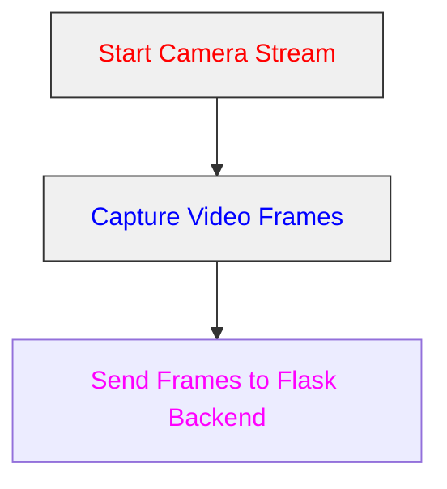
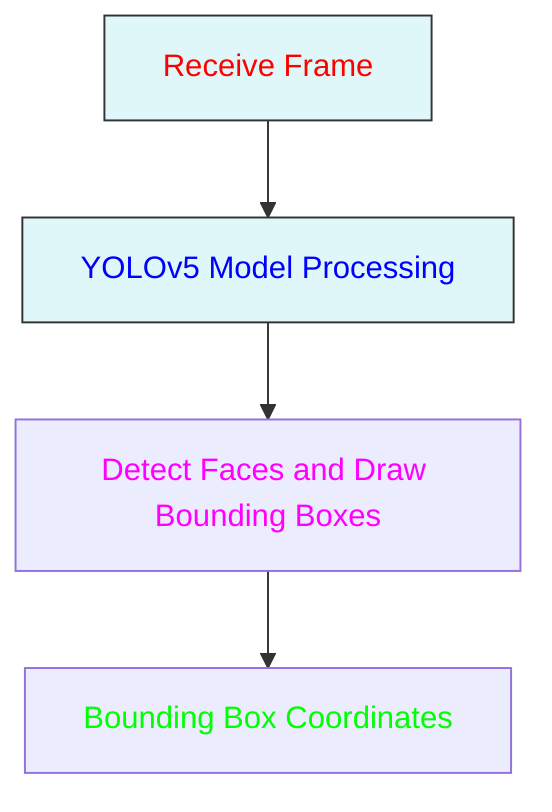
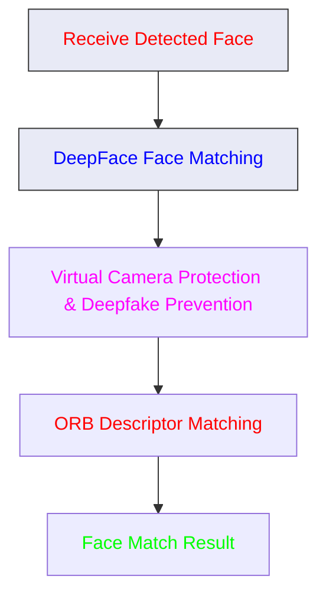
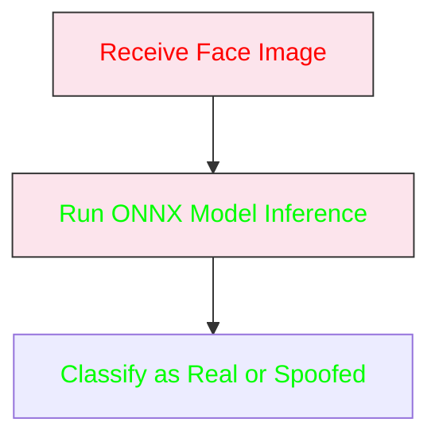
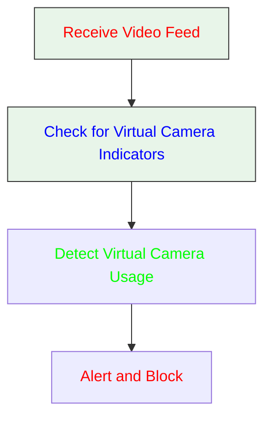
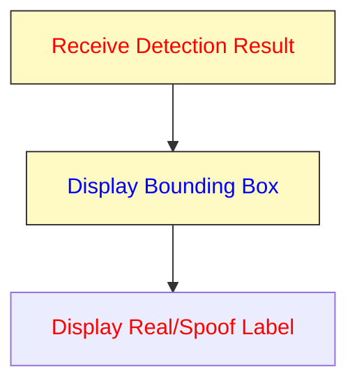
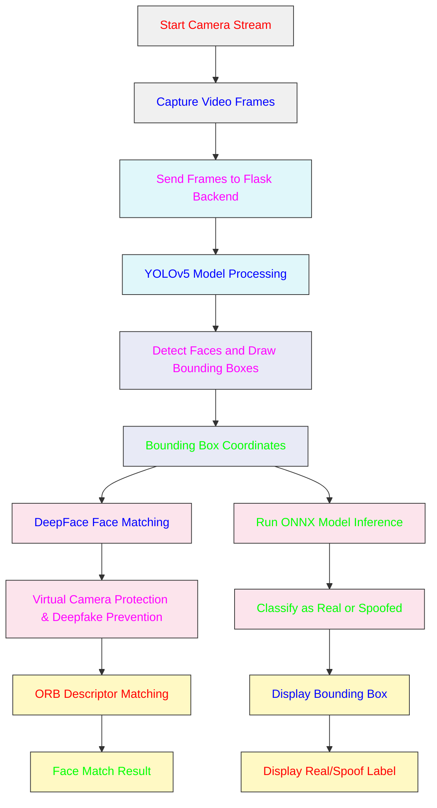

# **Face Liveliness Check in Web Platform**

**Face liveness detection** ensures that a face presented to a camera is from a real, living person rather than a static image, video, or mask. It’s essential for preventing spoofing attacks and verifying genuine user interaction.

---
# **Screenshots**
### **1. Video Stream Capture**

from graphviz import Digraph

# Create the graph using Graphviz
dot = Digraph(format='png')
dot.attr(bgcolor='white', rankdir='TD')

# Define nodes with styling
dot.node('A', 'Start Camera Stream', color='red', fontcolor='red', style='filled', fillcolor='#f0f0f0')
dot.node('B', 'Capture Video Frames', color='blue', fontcolor='blue', style='filled', fillcolor='#f0f0f0')
dot.node('C', 'Send Frames to Flask Backend', color='magenta', fontcolor='magenta', style='filled', fillcolor='#f0f0f0')

# Define edges
dot.edge('A', 'B')
dot.edge('B', 'C')

# Save and render the image
output_path = 
'
dot.render(output_path, format='png', cleanup=True)

print(f"Diagram saved as {output_path}.png")

---

# **Architecture**

### **1. Video Stream Capture**



### **2. Face Detection**



### **3. Face Matching with DeepFace and ORB Descriptors**



### **4. Anti-Spoofing Detection**



### **5. Virtual Camera Prevention**



### **6. Result Display**



### **Full Flowchart**




 **Active and Passive Liveness Detection** are two primary approaches to ensure a face presented to a camera is from a real, living person. Here's a brief overview:

### **Active Liveness Detection**

**Active liveness detection** requires the user to perform specific actions to prove their liveness. This method involves interaction from the user and can be used to distinguish between a live person and a static photo or video.

1. **Blink Detection**:
   - **Process**: Users are asked to blink their eyes or perform other specific facial movements.
   - **Purpose**: Ensures that the face is live and responsive.

### **Passive Liveness Detection**

**Passive liveness detection** does not require user interaction and relies on analyzing the face's properties to determine if it is live.

1. **Texture Analysis**:
   - **Process**: Examines skin texture and patterns to differentiate between real skin and images or masks.
   - **Purpose**: Detects anomalies that indicate the use of a static image.

2. **Depth Information**:
   - **Process**: Uses depth sensors or stereo cameras to capture 3D information about the face.
   - **Purpose**: Identifies the three-dimensional structure of the face, which static images lack.

3. **Reflection and Glare Analysis**:
   - **Process**: Analyzes reflections and glare on the face, which are present on real skin but not on printed images.
   - **Purpose**: Detects inconsistencies that suggest the presence of a photo or video.

4. **Light and Color Analysis**:
   - **Process**: Assesses how light interacts with the face, including reflections and shadows.
   - **Purpose**: Ensures the face is real and responds naturally to light changes.

## **Key Features**

1. **Real-time Face Detection**:
   - Detects live faces in real-time via the web browser using the user’s camera.
   - Captures video frames for processing.

2. **Anti-Spoofing Protection**:
   - Identifies and prevents spoof attacks (e.g., photos, videos, or masks) using deep learning models.

3. **ONNX Model Integration**:
   - Uses ONNX Runtime for fast and lightweight model inference.

4. **Cross-Browser Support**:
   - Compatible with Chrome, Firefox, and Edge.

5. **Face Detection using YOLOv5**:
   - High-speed and accurate face detection.

6. **DeepFace Integration**:
   - Used for face matching, virtual camera protection, and deepfake prevention.

7. **Virtual Camera Prevention**:
   - Detects and prevents the use of virtual cameras or software that manipulates the video feed.
   - Ensures the authenticity of the video source.

8. **Scalable Architecture**:
   - Built with React frontend and Flask backend.
   - Under 500ms and only 5MB

---

## **Technology Stack**

### **Frontend**

- **React.js**: A JavaScript library for building user interfaces.

### **Backend**

- **Flask**: A micro web framework written in Python.
 
- **ONNX Runtime**: Cross-platform, high-performance scoring engine for Open Neural Network Exchange (ONNX) models.

### **Machine Learning**

- **YOLOv5**: A state-of-the-art object detection model.
 
- **DeepFace**: A Python library for deep learning-based face recognition.

### **Additional Tools**

- **OpenCV**: An open-source computer vision and machine learning software library.
- **ONNX**: Open Neural Network Exchange, an open format for AI models.

## **System Architecture**

The **Face Liveliness Check** system involves capturing video frames from the browser, detecting faces, matching faces, detecting spoof attacks, and preventing virtual camera use. Here’s a detailed explanation of each component and how they interact:

1. **Video Stream Capture** (React Frontend):
   - Captures live video feed from the user's camera.
   - Sends individual frames to the Flask backend for processing.

2. **Face Detection** (YOLOv5 - Flask Backend):
   - Processes video frames to detect and bound faces.
   - Outputs bounding box coordinates for detected faces.

3. **Face Matching** (DeepFace and OpenCV - Flask Backend):
   - Extracts key points from detected faces and matches them with stored face data using DeepFace and ORB descriptors.
   - Includes virtual camera protection and deepfake prevention.

4. **Anti-Spoofing Detection** (ONNX Model - Flask Backend):
   - Classifies detected faces as real or spoofed using an ONNX model.
   - Provides liveness detection results.

5. **Virtual Camera Prevention** (Flask Backend):
   - Detects and prevents the use of virtual cameras or software that manipulates the video feed.

6. **Result Display** (React Frontend):
   - Displays bounding boxes around detected faces and the liveness results (real/spoof) in real-time.


---

## **Detailed Workflow Explanation**

### **1. Video Stream Capture (React Frontend)**

Captures video from the camera using HTML5 `getUserMedia` API. Each frame is sent to the Flask backend for processing.

**Code Snippet (React - Capture Stream)**:
```js
useEffect(() => {
    navigator.mediaDevices.getUserMedia({ video: true }).then((stream) => {
        videoRef.current.srcObject = stream;
        videoRef.current.play();
    });
}, []);
```

### **2. Face Detection using YOLOv5 (Flask Backend)**

YOLOv5 processes frames to detect faces. Outputs bounding boxes with coordinates.

**Code Snippet (YOLOv5 Integration)**:
```python
import torch

model = torch.hub.load('ultralytics/yolov5', 'yolov5s')  # Load YOLOv5 model

def detect_faces(frame):
    results = model(frame)
    return results.xyxy[0]  # Return bounding boxes
```

### **3. Face Matching with DeepFace and ORB Descriptors (Flask Backend)**

DeepFace and ORB extract key points from faces and match them with stored descriptors. Includes virtual camera protection and deepfake prevention.

**Code Snippet (DeepFace Integration)**:
```python
from deepface import DeepFace

def match_faces(face_image):
    result = DeepFace.find(face_image, db_path='path_to_database')
    return result
```

**Code Snippet (ORB Descriptor Matching)**:
```python
import cv2

orb = cv2.ORB_create()
keypoints, descriptors = orb.detectAndCompute(face_image, None)
# Matching keypoints with stored descriptors...
```

### **4. Anti-Spoofing Detection using ONNX (Flask Backend)**

ONNX model classifies faces as real or spoofed. Model inference is quick, typically under 500ms.

**Code Snippet (ONNX Model Inference

)**:
```python
import onnxruntime as ort

def detect_spoof(face_image):
    session = ort.InferenceSession('model.onnx')
    result = session.run(None, {'input': face_image})
    return result
```

### **5. Result Display (React Frontend)**

Displays bounding boxes and liveness results on the user's screen.

**Code Snippet (Display Results)**:
```js
function displayResults(results) {
     const videoElement = document.querySelector('video'); // Assuming you're using a <video> element to show the video feed
    const canvas = document.createElement('canvas');
    const ctx = canvas.getContext('2d');

    // Set canvas size to match video element
    canvas.width = videoElement.videoWidth;
    canvas.height = videoElement.videoHeight;
    document.body.appendChild(canvas);

    // Clear the canvas
    ctx.clearRect(0, 0, canvas.width, canvas.height);

    results.forEach(result => {
        const { x, y, width, height, label, status } = result; // Destructure relevant information

        // Draw bounding box
        ctx.beginPath();
        ctx.rect(x, y, width, height);
        ctx.lineWidth = 2;
        ctx.strokeStyle = status === 'real' ? 'green' : status === 'fake' ? 'red' : 'blue'; // Color based on status
        ctx.stroke();
        ctx.closePath();

        // Draw label
        ctx.fillStyle = 'white';
        ctx.font = '16px Arial';
        ctx.textAlign = 'left';
        ctx.textBaseline = 'top';
        ctx.fillText(`${label} (${status})`, x, y > 10 ? y - 10 : 10); // Adjust text position to avoid overflow
    });
}
```
