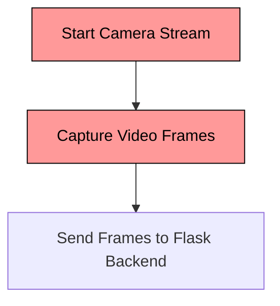
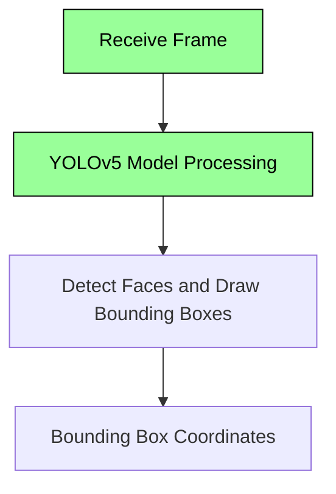
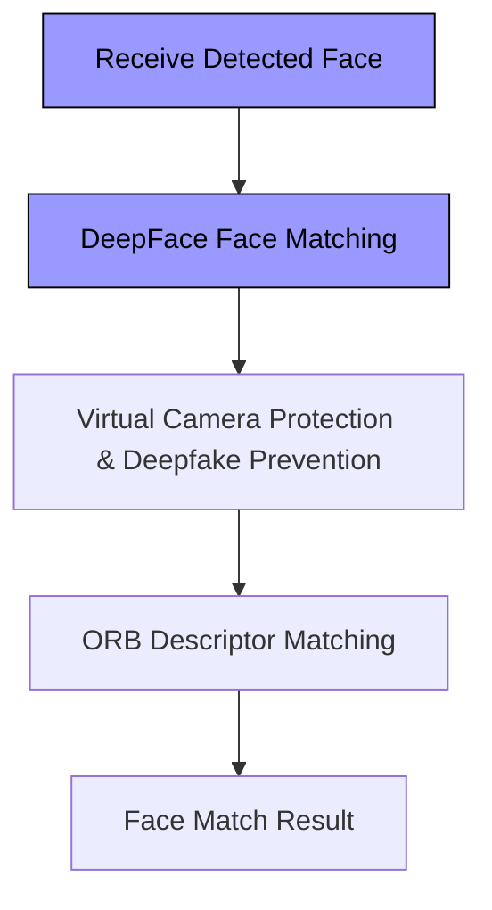
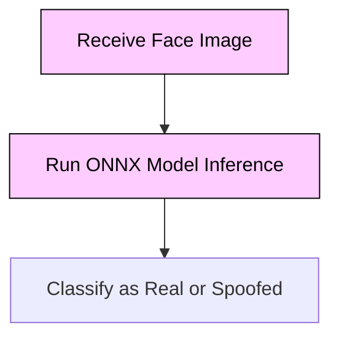
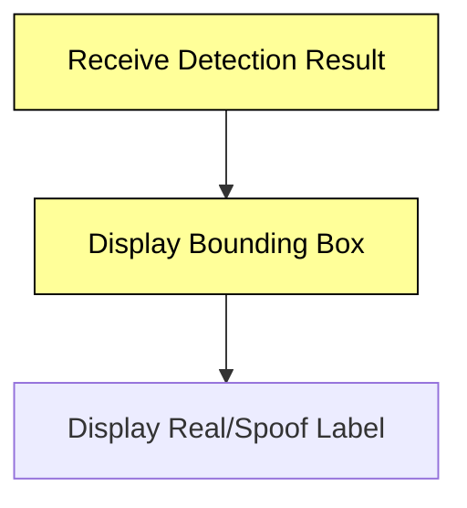
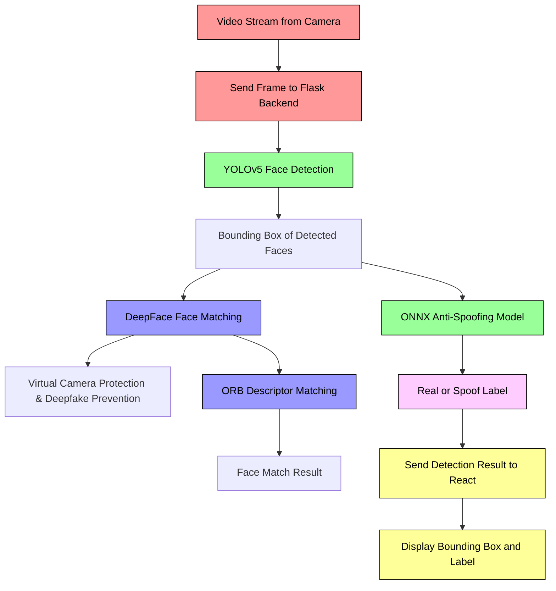

# **Face Liveliness Check in Web Platform**

## **Key Features**

1. **Real-time Face Detection**
   - Detects live faces in real-time using the user’s camera via the web browser.
   - Captures video frames for processing.

2. **Anti-Spoofing Protection**
   - Identifies and prevents spoof attacks (e.g., photos, videos, or masks) using deep learning models.

3. **ONNX Model Integration**
   - Utilizes ONNX Runtime for fast and efficient model inference.

4. **DeepFace Integration**
   - Uses DeepFace for face matching, virtual camera protection, and deepfake prevention.

5. **Cross-Browser Support**
   - Compatible with major browsers: Chrome, Firefox, and Edge.

6. **Face Detection using YOLOv5**
   - Employs YOLOv5 for high-speed and accurate face detection.

7. **OpenCV Face Matching**
   - Matches faces using ORB descriptors for enhanced recognition.

8. **Scalable Architecture**
   - Built using React for the frontend and Flask for the backend, allowing easy scalability.

---

## **System Architecture**

The **Face Liveliness Check** system involves capturing video frames, detecting and matching faces, and performing anti-spoofing checks. Here’s a breakdown of each component:

1. **Video Stream Capture** (React Frontend)
   - Captures live video feed from the user’s camera.
   - Sends frames to the Flask backend for processing.

2. **Face Detection** (YOLOv5 - Flask Backend)
   - Processes the video frames to detect faces and draw bounding boxes.

3. **Face Matching** (DeepFace - Flask Backend)
   - Matches faces and ensures virtual camera protection.

4. **Face Matching with ORB Descriptors** (OpenCV - Flask Backend)
   - Extracts features from faces and matches them with stored data.

5. **Anti-Spoofing Detection** (ONNX Model - Flask Backend)
   - Classifies faces as real or spoofed using an ONNX model.

6. **Result Display** (React Frontend)
   - Displays bounding boxes and liveness results in real-time.

---

## **Module-Specific Flowcharts**

### 1. **Video Stream Capture (React Frontend)**



**Explanation:**
- **Start Camera Stream**: Initializes the video stream from the user’s camera.
- **Capture Video Frames**: Captures frames from the live video feed.
- **Send Frames to Flask Backend**: Transmits frames for processing.

### 2. **Face Detection (YOLOv5 - Flask Backend)**



**Explanation:**
- **Receive Frame**: Receives video frame from the frontend.
- **YOLOv5 Model Processing**: Processes the frame to detect faces.
- **Detect Faces and Draw Bounding Boxes**: Identifies faces and draws bounding boxes.
- **Bounding Box Coordinates**: Outputs coordinates of detected faces.

### 3. **Face Matching with DeepFace and ORB Descriptors (Flask Backend)**



**Explanation:**
- **Receive Detected Face**: Receives the face image.
- **DeepFace Face Matching**: Matches faces and ensures virtual camera protection.
- **Virtual Camera Protection & Deepfake Prevention**: Verifies authenticity.
- **ORB Descriptor Matching**: Matches features using ORB descriptors.
- **Face Match Result**: Provides face match results.

### 4. **Anti-Spoofing Detection (ONNX - Flask Backend)**



**Explanation:**
- **Receive Face Image**: Receives the face image for analysis.
- **Run ONNX Model Inference**: Uses ONNX model to classify face.
- **Classify as Real or Spoofed**: Outputs liveness result.

### 5. **Result Display (React Frontend)**



**Explanation:**
- **Receive Detection Result**: Receives results from the backend.
- **Display Bounding Box**: Shows bounding boxes around faces.
- **Display Real/Spoof Label**: Displays liveness check results.

---

## **Full Flowchart**



---

## **Detailed Workflow Explanation**

### 1. **Video Stream Capture (React Frontend)**

Captures video from the camera using HTML5 `getUserMedia` API. Each frame is sent to the Flask backend for processing.

**Code Snippet (React - Capture Stream)**:
```js
useEffect(() => {
    navigator.mediaDevices.getUserMedia({ video: true }).then((stream) => {
        videoRef.current.srcObject = stream;
        videoRef.current.play();
    });
}, []);
```

### 2. **Face Detection using YOLOv5 (Flask Backend)**

YOLOv5 processes frames to detect faces. Outputs bounding boxes with coordinates.

**Code Snippet (YOLOv5 Integration)**:
```python
import torch

model = torch.hub.load('ultralytics/yolov5', 'yolov5s')  # Load YOLOv5 model

def detect_faces(frame):
    results = model(frame)
    return results.xyxy[0]  # Return bounding boxes
```

### 3. **Face Matching with DeepFace and ORB Descriptors**

- **DeepFace**: Matches detected faces with known faces and provides virtual camera protection.
- **ORB Descriptors**: Enhances face matching with detailed feature extraction.

**Code Snippet (DeepFace Integration)**:
```python
from deepface import DeepFace

def match_faces(image1, image2):
    result = DeepFace.verify(image1, image2)
    return result['verified']
```

**Code Snippet (ORB Descriptors with OpenCV)**:
```python
import cv2

orb = cv2.ORB_create()

def match_with_orb(image1, image2):
    kp1, des1 = orb

.detectAndCompute(image1, None)
    kp2, des2 = orb.detectAndCompute(image2, None)
    bf = cv2.BFMatcher(cv2.NORM_HAMMING, crossCheck=True)
    matches = bf.match(des1, des2)
    return len(matches)
```

### 4. **Anti-Spoofing Detection using ONNX (Flask Backend)**

ONNX model classifies faces as real or spoofed. Model inference is quick, typically under 500ms.

**Code Snippet (ONNX Model Inference)**:
```python
import onnxruntime as ort

ort_session = ort.InferenceSession("anti_spoofing_model.onnx")

def run_onnx_model(face_image):
    input_data = preprocess_image(face_image)
    outputs = ort_session.run(None, {"input": input_data})
    return outputs[0]  # Real or spoof label
```

### 5. **Displaying Results (React Frontend)**

Displays results on the frontend, including bounding boxes and liveness labels.

**Code Snippet (React - Display Results)**:
```js
const renderBoundingBox = (bbox, label) => {
    // Draw bounding box around detected face
    ctx.strokeRect(bbox.x, bbox.y, bbox.width, bbox.height);
    ctx.fillText(label, bbox.x, bbox.y - 10);  // Display real/spoof label
};
```

---

## **Installation**

1. **Clone the Repository**:
   ```bash
   git clone https://github.com/VIBUDESH07/face_liveliness_web_platform
   cd face_liveliness_web_platform
   ```

2. **Install Backend Dependencies**:
   ```bash
   pip install -r requirements.txt
   ```

3. **Install Frontend Dependencies**:
   Navigate to the frontend directory:
   ```bash
   cd frontend
   npm install
   ```

4. **Run the Flask Backend**:
   ```bash
   python app.py
   ```

5. **Run the React Frontend**:
   ```bash
   npm start
   ```

---

## **Model Training and Conversion**

- **Train Anti-Spoofing Model**:
  - Use datasets like **CelebA-Spoof** or **CASIA-Surf** for training.

- **Convert Model to ONNX**:
  - Export your PyTorch model to ONNX format.

  **PyTorch to ONNX Export**:
  ```python
  import torch

  dummy_input = torch.randn(1, 3, 224, 224)  # Model input shape
  torch.onnx.export(trained_model, dummy_input, "anti_spoofing_model.onnx", export_params=True)
  ```

- **DeepFace Integration for Face Matching**:
  - Integrate the **DeepFace** module as needed for face verification.

